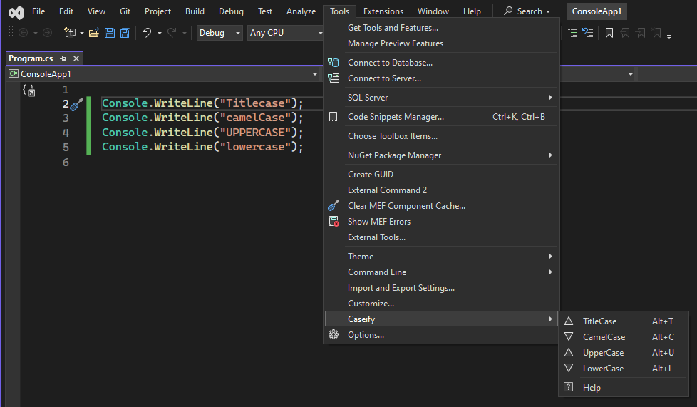

# Caseify

Caseify, a robust Visual Studio extension, simplifies and improves coding by seamlessly transforming code element casing. It empowers developers to effortlessly modify variable, function, and code component casing, ensuring consistency and readability. With automation, Caseify enhances coding efficiency, letting users concentrate on logic and structure rather than manual formatting, thereby boosting productivity and maintaining a uniform coding style in Visual Studio.


## Table of Contents

- [Features](#features)
- [Installation](#installation)
- [Contributing](#contributing)

## Features

- TitleCase : ``` ALT + T ``` :  [ hello --> Hello ]
- CamelCase : ``` ALT + C ``` :  [ HelloWorld --> helloWorld ]
- UpperCase : ``` ALT + U ``` :   [ HelloWorld --> HELLOWORLD ]
- LowerCase : ``` ALT + L ``` :   [ HelloWorld --> helloworld ]


## Installation

Marketplace: https://marketplace.visualstudio.com/items?itemName=Sailesh-BK.Caseify
1) Open Visual Studio.

2) Navigate to the Extensions menu by selecting Extensions > Manage Extensions.

3) In the Extensions window, switch to the Online tab on the left sidebar.

4) Search for "Caseify" in the search bar.

5) Locate Caseify in the search results and click on it.

6) Click the Install button to begin the installation process.

7) Follow any additional prompts or confirmations as needed.

Once the installation is complete, restart Visual Studio to activate Caseify.
Now, Caseify is ready to enhance your coding experience by simplifying and automating casing modifications in your projects. Enjoy the improved consistency and readability brought to you by Caseify within your Visual Studio environment.


## Contributing
Thank you for considering contributing to Caseify! We welcome contributions from the community to help make this Visual Studio extension even more robust and user-friendly.

For information on contributing to this project, please see the [contributing guide](.github/CONTRIBUTING.md).